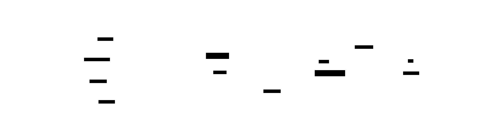
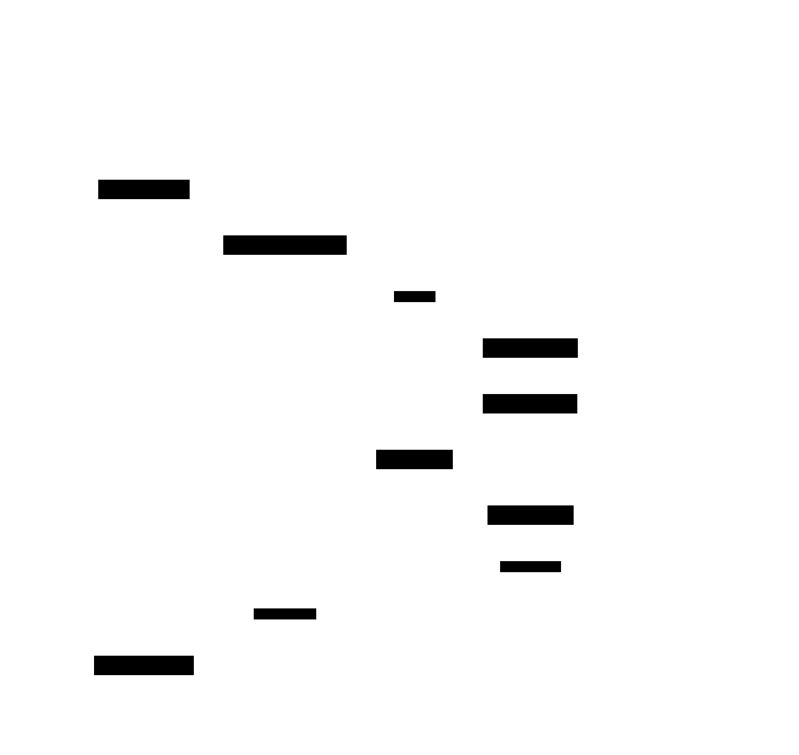

# Missions — multi-agent orchestration design

**Question.** How do agents delegate to each other dynamically? Chains
(PT → web-dev), deep nesting (agent → agent → agent), long-running work, schedules
("every morning read me the news"), real-world actions needing approval ("book a
flight") — with Gaia acting as the CEO/PM of a company of souls that are *logically*
always awake.

**Answer (short).** A persistent **task board** (SQLite blackboard) + **one dispatcher**
in the daemon + **two delegation paths**: `consult_soul` (agent-as-tool, synchronous,
for quick expert answers inside a turn) and `task_create` (board, asynchronous, for real
work products, parallelism, approvals and arbitrary nesting). A2A stays at the edge as
the interop layer for *external* agents, not the internal bus.



---

## 1. Why today's primitive isn't enough

`delegate_to_soul` (`souls/delegate.py`) is synchronous, single-hop, root-only, capped
at 300s, and lives entirely in memory. It cannot:

- **chain** — Gaia *can* call it twice in one turn (PT then web-dev with the answer in
  context), but the whole chain must fit one turn and one timeout;
- **nest** — souls deliberately don't get the delegate tool (a soul can't spawn souls),
  so agent→agent→agent is impossible;
- **outlive a turn** — nothing survives a restart, nothing runs while you're away;
- **parallelize** — one soul at a time;
- **wake on schedule** — no cron;
- **pause for a human** — no approval gate can hold a synchronous call for hours.

## 2. Prior art

| System | Mechanism | Lesson taken |
|---|---|---|
| **hermes-agent kanban** | Durable SQLite board (`~/.hermes/kanban.db`), `kanban_*` toolset, dispatcher spawns workers; explicit **dual model**: `delegate_task` (sync, result into the parent's context) for short reasoning, the board for cross-agent / durable / HITL work | The dual model and the board schema — this design matches it almost 1:1, adapted to gaia's dynamically-forged souls |
| **Magentic-One (MSR)** | Orchestrator + **task ledger** (facts/plan; outer loop) + **progress ledger** (per-step reflection; inner loop); re-plans when stalled | Stall detection + re-planning is what makes an orchestrator trustworthy on long missions → phase 4 |
| **A2A protocol** | RPC envelope + AgentCards between agents | Confirmed *not enough* alone: no shared state, no budgets, no global observability. Right job: external interop (phase 5 bridge) |
| **CrewAI / LangGraph** | Compile-time crews / graphs | Wrong shape for souls forged at runtime; the "graph" must be data (board rows), not code |
| **AutoGen group chat** | All agents in one conversation | Token-heavy, non-durable, no isolation — rejected |
| **Blackboard systems (classic AI)** | Shared workspace; specialists react to entries | The board *is* a blackboard; the lineage is 40 years old and sound |

ADK pieces reused as-is: `AgentTool` (already runs the smith inside delegate),
the nested `Runner` pattern (`_run_soul`), persisted AgentCards
(`agents/factory.py:to_agent_card`).

## 3. The design

### The board (`~/.gaia/tasks.db`, stdlib sqlite3)

One table, the whole company's state:

```
tasks(id, mission_id, parent_id, title, spec, status, assignee,
      blocked_by, depth, artifacts, result, notes, created_by,
      approval_class, budget_used, created_at, updated_at)
```

A **mission** is a root task plus its tree (`parent_id` chain). Artifacts are
workspace paths — hierarchical workspaces (see `workspace-design.md`) already let Gaia
read every soul's output, so handing T1's deliverable to T2 is just a path.


### The dispatcher (in `gaia serve`)

The **only thing awake**. Loop: pick ready tasks (inbox, unblocked) → ask the smith
*reuse or forge* → run the soul on the task via a nested Runner → post
result/artifacts → unblock dependents → notify the creator (a parent soul gets
re-dispatched; the user gets a push). Crash recovery on boot: `running → inbox`.

"All souls wake up and wait" is **logical**, not physical: a soul is a stateless
`LlmAgent` (a prompt + tools); an idle process per soul would burn RAM doing nothing.
The registry is the roster; the board is the inbox; the dispatcher is the alarm clock.
From the outside it behaves exactly like a building full of waiting employees — at
zero idle cost. (hermes runs physical worker processes; gaia's souls are forged
dynamically, which makes process-per-soul management a poor fit. A "resident twin"
mode can be added later if a use case demands it.)

### Two delegation paths (the nesting answer)

| | `consult_soul(question)` | `task_create(spec, parent=…)` |
|---|---|---|
| mechanism | ADK `AgentTool` — sync call inside the parent's turn | row on the board — async |
| parent context | survives naturally (the function-call loop **is** the resume) | yielded; parent re-run with results + its saved notes |
| good for | quick expert opinion ("protein target for cutting?") | work products, long jobs, parallel fan-out, approval-gated steps |
| durability | none (in-memory turn) | survives restarts |
| HITL mid-flow | impossible (would hang the turn) | task parks in `awaiting_approval` |
| guards | depth cap 2, shares the turn's clock | depth cap 3, cycle check on the parent chain, per-mission caps |

A soul that needs *an answer* consults; a soul that needs *work done* files a subtask
and yields. Both are taught in the soul instruction text. The synchronous
`delegate_to_soul` fast-path stays for Gaia's quick one-shot delegations.

**Resume semantics (board path):** when a subtask completes, the parent task is
re-dispatched from scratch with `spec + parent's saved notes + subtask results` as
input. Stateless, restart-proof, simple; costs some repeat tokens. Persisting the ADK
session for a true resume is a later optimization, not a correctness need.

### Schedules (cron)

A schedules table (yaml-canonical in `gaia.yaml`, **and** chat-managed — Gaia gets
schedule tools + a `/schedules` command, so "every morning at 7 give me AI news" just
works). The daemon's clock drops the task on the board at the appointed time; the
normal machinery runs it; the result is **pushed proactively** to your configured
channel. That is the "wake up a new LlmAgent with a specific request" cron model.

### Notifications

Each mission records its originating connector; results, questions and approval
requests are pushed through it (cron missions use a configured default channel).

### Approval gates (HITL)

Config lists gated action classes — `spend`, `book`, `send_as_me`, `destructive`. A
task carrying a gated class parks in `awaiting_approval`; you get a push
("⏸ purchase $420 — approve?"); `/tasks approve <id>` releases it. Everything else is
autonomous.

### Budgets and runaway guards

Per-mission caps (config defaults): `max_tasks` ≈ 20, `max_depth` 3 (board) / 2
(consult), `max_hours`. Breach → mission pauses and asks you. Cycle detection walks the
parent chain (A→B→A is refused at `task_create`). Runaway *forging* (the smith hiring a
new employee per task variant) is bounded by the smith's reuse bias + a soul-count cap,
and the analyzer (#19) can later propose merging near-duplicate souls. Token metering
per mission is a follow-up once cost plumbing exists.

## 4. Worked examples

### "Build a website focusing on gym improvement in my A/B plan"



Note the two delegation kinds in one mission: the PT *consults* the nutritionist
(quick answer, no board hop), while Gaia used *board tasks* for the real deliverables
with a dependency edge (T2 `blocked_by` T1).

### "Every morning at 7, read me the AI news"

1. You say it in chat → Gaia calls its schedule tool → entry saved (visible in
   `gaia.yaml` and `/schedules`).
2. 07:00 — daemon clock fires → task on board → dispatcher → smith reuses the
   `news-reader` soul → it searches/fetches → posts a brief.
3. Brief pushed to you on WhatsApp. No process was idle overnight.

### "Book me a flight to NYC next Tuesday"

1. Mission: `T1 research flights` → `T2 purchase (approval_class=spend, blocked_by=T1)`
   → `T3 calendar entry (blocked_by=T2)`.
2. T1 runs autonomously; T2 parks in `awaiting_approval`; you get
   "⏸ TLV→NYC Tue 06:40, $420 — approve?"; you reply approve; T2 runs; T3 runs.
3. Confirmation pushed. The mission survived the hours you took to answer — that's the
   board, not a hung function call.

## 5. Challenges (named, with mitigations)

1. **Runaway company** — smith forges a soul per variation → soul-count cap, reuse
   bias, analyzer merge proposals (#19/#117).
2. **Ping-pong** — A files for B, B files back for A → ancestry cycle check at
   `task_create` + mission caps as the backstop.
3. **Stall** — mission spins without progress → v1: caps + timeouts; properly solved by
   the phase-4 progress review (Magentic-One's inner loop).
4. **Restart mid-mission** — board survives; `running → inbox` on boot re-dispatches;
   re-run-with-results makes repeated execution safe *for idempotent work* — souls
   write into their own workspaces, so re-runs overwrite rather than duplicate; gated
   classes protect non-idempotent real-world actions.
5. **Notify while offline** — push through the connector; the daemon is the sender, so
   "offline" only means *you* haven't read it yet.
6. **Token burn of re-runs** — bounded by mission caps; session-resume optimization
   filed for when long missions justify it.
7. **The board becomes a single point of contention** — SQLite WAL handles one daemon +
   CLI/chat readers comfortably at this scale (hermes ships exactly this).

## 6. Phases

- **P1 — the board**: `missions/store.py` (schema + CRUD), `task_*` tools (Gaia only),
  `/tasks` command + `gaia task` CLI. Gaia can already run a manual kanban.
- **P2 — the engine**: dispatcher in the daemon, crash recovery, cron schedules
  (yaml + chat tools + `/schedules`), proactive push. Missions run unattended.
- **P3 — the company**: `consult_soul` for souls, `task_create` for souls,
  re-run-with-results, depth/cycle/caps, approval gates. Agent→agent→agent works.
- **P4 (later) — the planner**: mission → task-DAG decomposition agent; progress
  review + re-plan-on-stall.
- **P5 (later) — the embassy**: A2A bridge — external agents join the board as
  workers via their persisted AgentCards.
- **Later singles**: session-resume, token metering, resident-twin souls.

**Sources:** [hermes kanban](https://hermes-agent.nousresearch.com/docs/user-guide/features/kanban) ·
[hermes delegation](https://hermes-agent.nousresearch.com/docs/user-guide/features/delegation) ·
[Magentic-One](https://www.microsoft.com/en-us/research/articles/magentic-one-a-generalist-multi-agent-system-for-solving-complex-tasks/) ·
[Magentic-One paper](https://arxiv.org/html/2411.04468v1)
